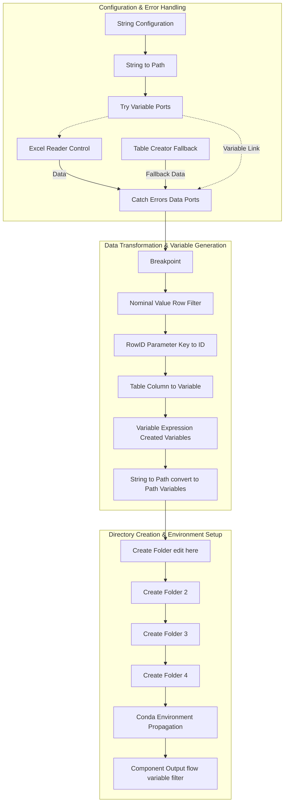

# Control Component Documentation

> **Workflow Context:** `claims p1v2` -> `Control` Component  
> **Primary Purpose:** Initializes execution parameters, handles configuration file loading with fallback safety, generates environment flow variables, creates output directory structures, and propagates Python Conda environments.

---

## 1. Overview & Architecture

The **Control Component** is a core initialization block in the KNIME workflow `claims p1v2`. It sets up runtime parameters by attempting to read an external Excel configuration file (`Control_Settings.xlsx`). If the file is missing or inaccessible, an internal **Try-Catch** error-handling mechanism seamlessly switches to a fallback default dataset created via a `Table Creator` node, preventing workflow termination.

### High-Level Workflow Diagram

---

## 2. File I/O Specifications

| Operation | Node Name / Type | Path / Details | Source / Destination |
| :--- | :--- | :--- | :--- |
| **Input (Primary)** | Excel Reader *(Control)* | `../../01 Into Knime/Control_Settings.xlsx` | External Excel File |
| **Input (Fallback)** | Table Creator | Pre-defined key-value parameter table | Internal Workflow Storage |
| **Directory Output** | Create Folder *(x4 Nodes)* | Dynamic system paths generated by Variable Expression | Local File System |
| **Component Output** | Component Output *(flow variable filter)* | Processed Flow Variables & Conda Environment | Main Workflow (`claims p1v2`) |

---

## 3. Node-by-Node Pipeline Specification

### Phase 1: Path Resolution & Error Handling Stream

  1. **String Configuration**
    - **Type:** Configuration Node
    - **Function:** Captures the raw text input path for the `Control_Settings.xlsx` file.

  2. **String to Path (Variable)**
    - **Type:** Variable Transformation Node
    - **Function:** Converts the input string into a KNIME-compliant `Path Variable`.

  3. **Try (Variable Ports)**
    - **Type:** Flow Control (Try Block Start)
    - **Function:** Initiates a failure-safe execution zone for variable-driven file operations.

  4. **Excel Reader (Control)**
    - **Type:** Data Input Node
    - **Function:** Reads the configuration sheet from `../../01 Into Knime/Control_Settings.xlsx`.
    - **Target Path:** `../../01 Into Knime/Control_Settings.xlsx`

  5. **Table Creator**
    - **Type:** Data Source Node
    - **Function:** Holds fallback default configuration values if `Control_Settings.xlsx` is missing.

  6. **Catch Errors (Data Ports)**
    - **Type:** Flow Control (Catch Block End)
    - **Function:** Evaluates `Excel Reader` execution. If successful, passes Excel data; if failed, redirects execution to use `Table Creator` data.

!!! failure "Known Execution Exception"
    **Error Message:** `Execution failed in Try-Catch block: The specified file ../../01 Into Knime/Control_Settings.xlsx does not exist.`
    
    **Handling Mechanism:** Caught by `Catch Errors (Data Ports)`, activating the fallback branch (`Table Creator`).

---

### Phase 2: Data Filtering & Parameter Restructuring

  1. **Breakpoint**
    - **Type:** Validation Node
    - **Function:** Evaluates data validity; halts execution if input table criteria are not met.

  2. **Nominal Value Row Filter (Number Filter)**

    - **Type:** Data Filtering Node
    - **Function:** Filters rows based on parameter keys/values.

  3. **RowID (Parameter Key to ID)**
    - **Type:** Row Manipulation Node
    - **Function:** Promotes the parameter key column into the table's `RowID`, enabling direct conversion into named variables.

---

### Phase 3: Flow Variable Generation & Directory Setup

  1. **Table Column to Variable (Parameter Values to Flow Variables)**
    - **Type:** Variable Generation Node
    - **Function:** Converts table columns into KNIME Flow Variables.

  2. **Variable Expression (Created Variables)**
    - **Type:** Expression Evaluator
    - **Function:** Constructs dynamic output folder path strings using string concatenation/logic.

  3. **String to Path (Variable) (convert to Path Variables)**
    - **Type:** Variable Conversion Node
    - **Function:** Converts generated path strings into native KNIME `Path` object variables.

  4. **Create Folder (4 Sequential Nodes)**
    - **Type:** File System Operation Nodes
    - **Function:** Sequentially provisions 4 physical output directories on disk based on the flow variables.

  5. **Conda Environment Propagation**
    - **Type:** Environment Node
    - **Function:** Enforces the Python Conda environment requirements for downstream Python execution nodes.

  6. **Component Output (flow variable filter)**
    - **Type:** Component Boundary Node
    - **Function:** Exports sanitized Flow Variables to downstream components in `claims p1v2`.

---

## 4. Maintenance & Troubleshooting Guide

!!! note "Resolving Excel Reader File Not Found Error"
    To execute the primary path without triggering the `Catch Errors` fallback:
    
    1. Verify that the file `Control_Settings.xlsx` exists in the relative directory: `../../01 Into Knime/`.
    2. Check file permissions and ensure the sheet structure matches expected parameter column headers.
    3. If running on a KNIME Server or AP workspace, ensure the relative path root points to the correct workspace anchor.