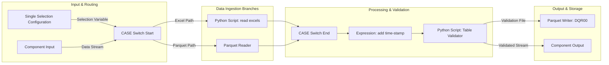

---
# Claims Ingestion &amp; Data Validation Workflow (`Ingest` Component)

Documentation for the **Ingest** component within the **KNIME Claims Processing Pipeline** (`claims p1v2`).

---

## 📌 Overview

The **Ingest** component serves as the entry point for the claims processing pipeline. It dynamically ingests data from heterogeneous sources (Excel or Parquet), applies processing timestamps, executes schema and data validation rules, and outputs validated datasets alongside Data Quality Reports (DQR).

---

## 🏗️ Architecture &amp; Flow Diagram




---

## ⚙️ Detailed Node Breakdown

### 1\. Input &amp; Control Layer

| Node Name                          | Node Type           | Description                                                                                                              | Input Source / Connection                                     |
| ---------------------------------- | ------------------- | ------------------------------------------------------------------------------------------------------------------------ | ------------------------------------------------------------- |
| **Single Selection Configuration** | Configuration Node  | Allows user/flow parameter selection to choose between Excel or Parquet ingestion paths.                                 | User configuration / Flow variable                            |
| **Component Input**                | Subnode / Interface | Ingress interface receiving parameters and incoming data streams into the component.                                     | Parent workflow pipeline                                      |
| **CASE Switch Start**              | Control Flow        | Dynamically routes execution to either the Excel reader branch or Parquet reader branch based on configuration settings. | Connected to Single Selection Configuration &amp; Component Input |

---

### 2\. File Reading &amp; Ingestion Layer

| Node Name                       | Node Type           | File Format / Location                           | Description                                                                       |
| ------------------------------- | ------------------- | ------------------------------------------------ | --------------------------------------------------------------------------------- |
| **Python Script** (read excels) | Python Scripting    | **Excel files (** **.xlsx** **,** **.xls** **)** | Custom Python script executing batch reading and formatting of Excel claim files. |
| **Parquet Reader**              | Native KNIME Reader | **Parquet files (** **.parquet** **)**           | Reads high-performance columnar Parquet claim files.                              |

---

### 3\. Transformation &amp; Validation Layer

| Node Name           | Label / Action  | Description                                                                                                  | Output                                          |
| ------------------- | --------------- | ------------------------------------------------------------------------------------------------------------ | ----------------------------------------------- |
| **CASE Switch End** | Merge Streams   | Recombines execution branches from Excel and Parquet readers into a unified data table.                      | Single merged data stream                       |
| **Expression**      | add time-stamp  | Appends an execution timestamp column to mark ingestion time for auditing and version control.               | Timestamps added to claims table                |
| **Python Script**   | Table Validator | Runs programmatic validation checks (schema verification, type checks, missing value flags, business rules). | Two output ports: Data stream &amp; Quality Metrics |

---

### 4\. Output &amp; Data Storage Layer

| Node Name            | Label / Target | Target File / Destination | Description                                                                         |
| -------------------- | -------------- | ------------------------- | ----------------------------------------------------------------------------------- |
| **Parquet Writer**   | DQR00          | **DQR00.parquet**         | Writes Data Quality Report metrics and validation logs into a Parquet storage file. |
| **Component Output** | Main Data Exit | Downstream Pipeline       | Passes validated claims data to subsequent pipeline components.                     |

---
## 🐍 Python Scripts Implementation

This section contains code templates and script placeholders for the two Python nodes in the KNIME workflow.

### 1\. Node: `Python Script` (`read excels`)

* **Workflow Position**: Executed on the upper branch after `CASE Switch Start` when Excel format is selected.
* **Input**: File path / directory variable from flow variables or `knio.flow_variables`.
* **Output Port 1**: Combined Pandas DataFrame containing raw ingested claims data.

**you can see more about it in the following link**

[py script](./py-read-excel.md)

### 2\. Node: `Python Script` (`Table Validator`)

* **Workflow Position**: Executed after timestamp creation (`Expression` node).
* **Input Port 1**: Claims DataFrame with timestamp added.
* **Output Port 1**: Cleaned &amp; Validated Claims Table (sent to `Component Output`).
* **Output Port 2**: Data Quality Report / Validation Log Table (sent to `Parquet Writer` \- `DQR00`).

[py table validator](./py-Table-Validator.md)

---
## 📁 File I/O Summary

&gt; [!NOTE] **Summary of File Operations:**

* **Input Files (Reading):**
  * **Excel Files:** Read via `Python Script` (`read excels`).
  * **Parquet Files:** Read via `Parquet Reader`.
* **Output Files (Writing):**
  * **Data Quality Report (DQR):** Written to **DQR00** (`.parquet` format) via `Parquet Writer`.

---

## 🚀 How to Use in MkDocs &amp; VS Code

1. Save this content as `README.md` or `ingestion-pipeline.md` in your project's `docs/` directory.
2. In VS Code, install the **Markdown Preview Enhanced** or **Mermaid Preview** extension to view the interactive diagram.
3. In `mkdocs.yml`, include the file under `nav` and enable `pymdownx.superfences`:

```
site_name: Claims Pipeline Documentation
nav:
  - Ingestion Workflow: ingestion-pipeline.md

markdown_extensions:
  - pymdownx.superfences:
      custom_fences:
        - name: mermaid
          class: mermaid
          format: !!python/name:pymdownx.superfences.fence_code_format

```