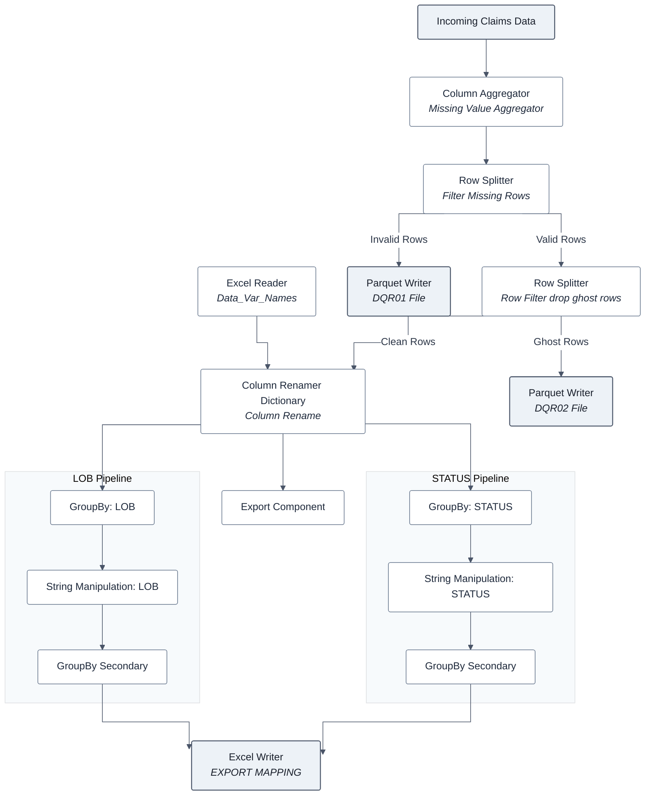

# KNIME Workflow Documentation: Standardize & Export (`claims p1v2`)

> **Workflow Path:** `claims p1v2` ➔ `Standardize & Export`  
> **Platform:** KNIME Analytics Platform  
> **Purpose:** Data quality auditing, dictionary-based column standardization, parallel aggregation by Line of Business (LOB) & Status, and automated multi-format report exporting.

---

## 📌 Executive Overview

The **Standardize & Export** sub-workflow forms the core ETL and data hygiene pipeline for processing insurance/claims dataset batches. It ensures data integrity through a multi-stage filtering process, dynamically renames dataset schema attributes using an external mapping dictionary, performs parallel data aggregation, and outputs standardized data alongside Data Quality Reports (DQR).

 KNIME Data Pipeline Diagram




---

## 🛠️ Step-by-Step Node & Component Analysis

### 1️⃣ Data Quality & Row Filtering Stage
*This initial stage handles missing values and isolates corrupt or empty rows to generate Data Quality Reports (DQR).*

| Node Type | Custom Label | Input Source | Primary Function | Output Destination |
| :--- | :--- | :--- | :--- | :--- |
| **Column Aggregator** | `Missing Value Aggregator` | Upstream Pipeline | Aggregates column metrics to identify missing values across data fields. | `Filter Missing Rows` |
| **Row Splitter** | `Filter Missing Rows` | `Missing Value Aggregator` | Splits records based on missing value thresholds.<br>• **Top Port:** Valid records<br>• **Bottom Port:** Corrupt/missing records | • **Top:** Row Filter (drop ghost rows)<br>• **Bottom:** Parquet Writer (DQR01) |
| **Parquet Writer** | `DQR01` | `Filter Missing Rows` (Bottom) | **[Output File]** Exports invalid/missing rows to a Parquet file for Data Quality Audit 01. | File System (`.parquet`) |
| **Row Splitter** | `Row Filter (drop ghost rows)` | `Filter Missing Rows` (Top) | Filters out ghost/empty rows.<br>• **Top Port:** Clean data stream<br>• **Bottom Port:** Ghost rows | • **Top:** Column Rename (Dictionary)<br>• **Bottom:** Parquet Writer (DQR02) |
| **Parquet Writer** | `DQR02` | `Row Filter` (Bottom) | **[Output File]** Exports ghost/empty records to a Parquet file for Data Quality Audit 02. | File System (`.parquet`) |

---

### 2️⃣ Schema Standardization Stage
*This stage standardizes incoming attribute headers using a dynamic dictionary mapping from an external Excel file.*

```
Incoming Clean Data (Top) ─────┐
                               ├──► [ Column Renamer (Dictionary) ] ──► Standardized Data Stream
Excel Dictionary File (Bottom) ─┘
```

* **`Excel Reader (Data_Var_Names)` (Input File)**  
  * **Role:** Reads an external Excel configuration workbook (`Data_Var_Names`) containing old column names and target standardized variable names.
* **`Column Renamer (Dictionary)`**  
  * **Role:** Matches incoming data headers against the dictionary table and dynamically renames columns to align with standardized enterprise naming conventions.
* **`export` (Component)**  
  * **Role:** Encapsulated sub-component that receives a copy of the standardized data stream for downstream export tasks.

---

### 3️⃣ Parallel Transformation & Aggregation Stage
*After standardization, the pipeline splits into two concurrent transformation branches:*

#### 🔹 Branch A: Line of Business (LOB) Processing
1. **GroupBy (LOB):** Aggregates clean records grouped by the Line of Business attribute (`LOB`).
2. **String Manipulation:** Cleans, formats, and standardizes text strings resulting from the LOB aggregation.
3. **GroupBy:** Executes secondary aggregation to finalize summary statistics for LOB metrics.

#### 🔹 Branch B: Claim Status (STATUS) Processing
1. **GroupBy (STATUS):** Aggregates clean records grouped by claim lifecycle status (`STATUS`).
2. **String Manipulation:** Applies string functions and status categorization logic.
3. **GroupBy:** Executes secondary aggregation to finalize summary statistics for Status metrics.

---

### 4️⃣ Final Export Stage

* **`Excel Writer (EXPORT MAPPING)` (Output File)**  
  * **Role:** Combines output streams from both **Branch A (LOB)** and **Branch B (STATUS)** into dedicated sheets/tables inside a single Excel workbook.

---

## 📁 File I/O Architecture Summary

### 📥 Inputs
* **Node:** `Excel Reader (Data_Var_Names)`  
  * **Format:** XLSX / XLS  
  * **Purpose:** Column renaming mapping dictionary  

### 📤 Outputs
* **Node:** `Parquet Writer (DQR01)`  
  * **Format:** Parquet (`.parquet`)  
  * **Purpose:** Data Quality Audit Report 01 (Missing Value Rows)  
* **Node:** `Parquet Writer (DQR02)`  
  * **Format:** Parquet (`.parquet`)  
  * **Purpose:** Data Quality Audit Report 02 (Ghost / Empty Rows)  
* **Node:** `Excel Writer (EXPORT MAPPING)`  
  * **Format:** XLSX  
  * **Purpose:** Consolidated LOB and Status aggregation report  

---

## 🚦 Node Execution Status Guide

| Status Indicator | Visual Appearance | Meaning in Workflow | Action Required |
| :---: | :---: | :--- | :--- |
| **Executed / Configured** | 🟡 Yellow Node / 🟢 Green Light | Node is properly configured or successfully executed. | **None (Ready).** |
| **Unconfigured / File Warning** | 🔴 Red File Icon / 🔴 Red Light | File path or reader/writer settings need configuration. | **Double-click node to set input/output file paths.** |

---

