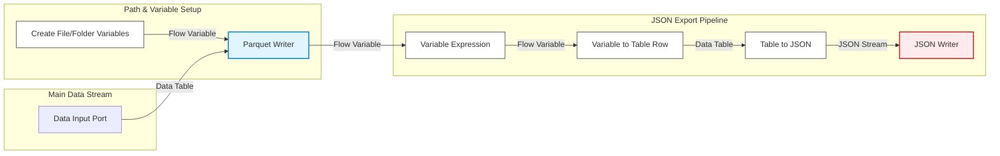

# 📦 Export Sub-Workflow Documentation

> **KNIME Analytics Platform** | **Workflow Path:** `claims p1v2` ➔ `Standardize & Export` ➔ `export`

---

## 📌 Overview

The **`export`** sub-workflow is a modular KNIME component responsible for serializing and storing processed claims data into dual output formats:

* 🟢 **Apache Parquet (`.parquet`)**: Optimized columnar storage format for high-speed analytical queries and data lake ingestion.
* 🟡 **JSON (`.json`)**: Structured document format designed for API consumption, web applications, or document databases.

This component handles path management, variable manipulation, and multi-format file serialization in a unified pipeline.

---

## 🏗️ Workflow Architecture

---

## 🧩 Node-by-Node Breakdown

| Step | Node Name | Category / Type | Input Port | Output Port | Description & Functionality |
| :---: | :--- | :--- | :--- | :--- | :--- |
| **1** | **Create File/Folder Variables** | Path Config | N/A | Flow Variable *(Red)* | Generates dynamic file and folder paths as flow variables for output destinations. |
| **2** | **Parquet Writer** | Data Writer | Data Table & Flow Var | Flow Variable *(Red)* | Writes the primary dataset to a `.parquet` file in the configured directory path. |
| **3** | **Variable Expression** | Logic | Flow Variable *(Red)* | Flow Variable *(Red)* | Evaluates and formats flow variables required for JSON generation (e.g., target file names). |
| **4** | **Variable to Table Row** | Converter | Flow Variable *(Red)* | Data Table *(Black)* | Converts flow variable key-value pairs into a single-row data table to feed downstream nodes. |
| **5** | **Table to JSON** | Transformer | Data Table *(Black)* | JSON Table *(Black)* | Converts the tabular structure into a formatted JSON payload. |
| **6** | **JSON Writer** | Data Writer | JSON Table *(Black)* | Disk File | Serializes and exports the JSON payload to a `.json` file on disk. |

---

## 💾 File I/O Summary

> ℹ️ **Input & Output Channels**
>
> * **Input Data Port (Left Boundary):** Receives the incoming standardized data table from the parent `Standardize & Export` container.
> * **Parquet File Output (`.parquet`):** Written directly by the **Parquet Writer** node using dynamic path variables.
> * **JSON File Output (`.json`):** Written directly by the **JSON Writer** node after variable-to-table conversion.

---

## 🔄 Data & Control Flow Mechanics

1. **Path Variable Propagation:**
   `Create File/Folder Variables` initializes path parameters and passes them via the top flow variable port (red line) to `Parquet Writer`.

2. **Primary Dataset Serialization:**
   The main data stream enters from the left component port into `Parquet Writer` and is written directly to disk.

3. **Sequential Flow Trigger:**
   Upon completion of the Parquet write operation, `Parquet Writer` passes execution/flow variables to `Variable Expression`.

4. **JSON Conversion Pipeline:**
   * `Variable Expression` tunes the variables.
   * `Variable to Table Row` converts these variables into a row dataset, bridging the gap between flow variables and table streams.
   * `Table to JSON` structures the row into a JSON object.
   * `JSON Writer` writes the final output file to disk.

---
