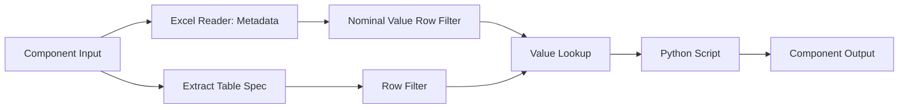

---
title: Float Parse Metanode Component
description: Technical documentation for the Float Parsing sub-workflow component in KNIME claims processing.
---

# Float Parse Component (`cmp-float-parse`)

The **Float Parse Component** is a metanode sub-workflow within the `claims_p2v1` pipeline. It automates the extraction, validation, and conversion of raw numerical and currency fields into standardized floating-point representations prior to database ingestion.

---

## 📌 Executive Overview



!!! note "Primary Objective"
Ensure string-formatted financial fields (e.g., `$1,250.50`, `1250,50 EUR`) are reliably cast into IEEE 754 standard double-precision floating-point numbers without losing precision.

---

## 🛠️ Internal Workflow Architecture

The sub-workflow consists of three distinct branches: schema extraction, metadata filtering, and execution.

=== "Workflow Topology"

* **`Component Input`**: Receives the incoming raw dataset stream.
* **`Excel Reader (Data_Var_Names)`**: Ingests variable mappings and variable-type definitions from central configuration files.
* **`Nominal Value Row Filter`**: Filters data variable mapping rules strictly for numeric and float types.
* **`Extract Table Spec`**: Dynamically extracts column headers and storage types from the incoming table.
* **`Value Lookup`**: Merges table specifications with expected target data types to identify columns requiring parsing.
* **`Row Filter`**: Isolates target numerical fields matching target criteria.
* **`Python Script`**: Applies vectorized string transformation, cleaning, and float casting.
* **`Component Output`**: Emits processed streams back to the parent `Standardize` pipeline.


=== "Data Flow Matrix"


| Node Name | Node Type | Purpose / Operation |
| :--- | :---: | :--- |
| `Component Input` | KNIME Core | Pipeline entry point for data & variables. |
| `Excel Reader` | I/O | Reads mapping file containing field specifications. |
| `Extract Table Spec` | Meta | Extracts incoming column names and schema. |
| `Value Lookup` | Data Manip | Joins incoming columns with configured float targets. |
| `Python Script` | Scripting | Executes Regex cleaning and `float()` conversion. |
| `Component Output` | KNIME Core | Emits processed dataset to downstream nodes. |


---

## 🐍 Python Execution Logic

The inner **Python Script** node dynamically identifies target columns and sanitizes non-numeric symbols using `pandas`.
??? note "Python Execution Logic — [amount_standardizer.py](.\amount_standardizer.md)"

    ```python
    import sys
    import importlib
    import traceback
    import knime.scripting.io as knio
    import pandas as pd

    # Get code path from flow variable
    code_base_path = knio.flow_variables.get('code_base_path')
    if not code_base_path:
        raise ValueError("Flow variable 'code_base_path' not set.")

    # Import and reload the module
    if code_base_path not in sys.path:
        sys.path.insert(0, code_base_path)

    try:
        import utils.amount_standardizer as amount_standardizer
        importlib.reload(amount_standardizer)
    except ImportError as e:
        raise ImportError(f"Cannot import amount_standardizer from {code_base_path}: {e}")

    # Read inputs
    data_df = knio.input_tables[0].to_pandas()
    amount_columns = knio.input_tables[1].to_pandas()["NEW"].tolist()

    tracking_columns = [
        "LA_SOURCE_FILE",
        "LA_SOURCE_PAGE", 
        "LA_R_FILE_NAME",
        "LA_SOURCE_ROW"
    ]

    # Call the standardization function
    try:
        standardized_df, summary_df, diagnostics_df = amount_standardizer.standardize_amounts(
            data_df=data_df,
            amount_columns=amount_columns,
            tracking_columns=tracking_columns,
            null_to_zero=True
        )

        # Log results
        amount_standardizer.log_standardization_report(summary_df)

        # Write outputs
        knio.output_tables[0] = knio.Table.from_pandas(standardized_df)
        knio.output_tables[1] = knio.Table.from_pandas(summary_df)
        knio.output_tables[2] = knio.Table.from_pandas(diagnostics_df)

    except Exception as e:
        print("ERROR: Node failed.")
        print(traceback.format_exc())
        raise
    ```

1. Reads input table directly into a pandas DataFrame using `knime.scripting.io`.
2. Pulls dynamic target column list passed via flow variables.
3. Removes non-numeric characters except decimals (`.`) and negative indicators (`-`).
4. Converts strings to `float64`, safely coercing unparseable values to `NaN`.

---

## ⚡ Data Quality Checks & Outputs

Data flowing through this metanode is continuously validated against data quality rules:

!!! tip "Target Output Streams"
* **Clean Data Stream**: Flows directly into the **`Date Parse`** metanode.
* **Audit Log Stream**: Exports invalid or failed float conversions directly to dedicated Parquet storage (`DQR03` / `DQR04` writer outputs).

* [x] Remove thousand-separator commas (`,`)
* [x] Strip non-numeric currency symbols (`$`, `€`, `EGP`)
* [x] Coerce nulls and blank strings to `NaN`
* [ ] *Future:* Handle European decimal comma notation (`1.000,00`) dynamically

---

## 🔍 Related Components

* [Date Parse Metanode Guide](https://www.google.com/search?q=cmp-date-parse.md)
* [LOB Mapping Metanode Guide](https://www.google.com/search?q=meta-lob-mapping.md)

```

```